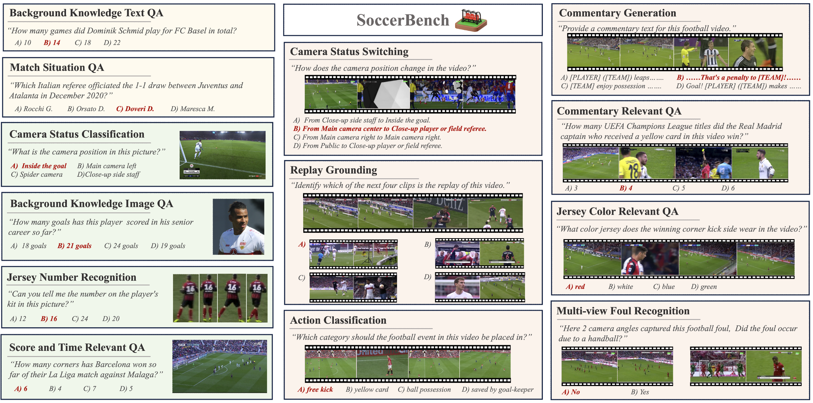
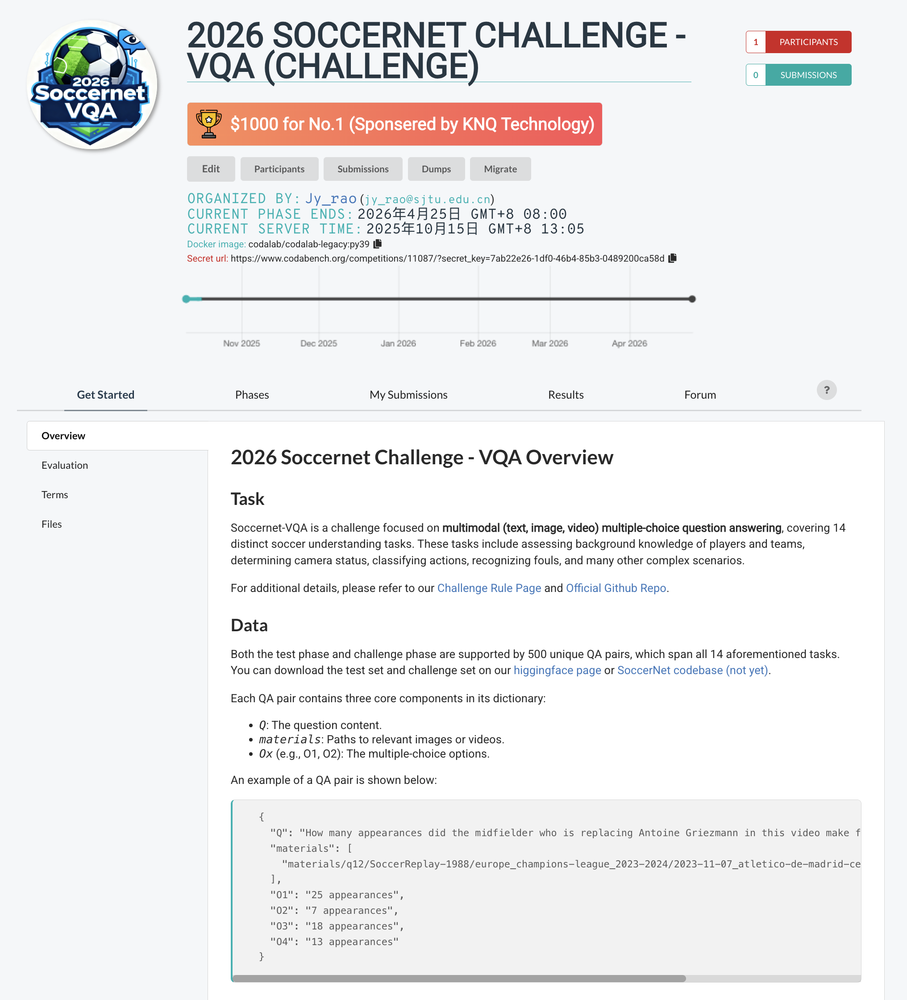

# SoccerNet Challenge 2026 - VQA (Visual Question Answering)

## 🎯 Challenge Overview
We are proud to announce the [**SoccerNet Challenge 2026 - Visual Question Answering (VQA)**](https://www.soccer-net.org/challenges/2026), building upon our previous work presented in ⚽️"***Multi-Agent System for Comprehensive Soccer Understanding***"⚽️ (MM'25). This challenge aims to push the boundaries of multimodal reasoning in multi-modal soccer understanding through a comprehensive question-answering framework. Here is the challenge page, more details about the SoccerAgent project could be found [here](https://github.com/jyrao/SoccerAgent/blob/main/Challenge.md). 

More details could be found at:

- 📑 Paper Relevant Links: [Paper](https://arxiv.org/abs/2505.03735) ⋅ [WebPage](https://jyrao.github.io/SoccerAgent) ⋅ [Benchmark](https://huggingface.co/datasets/Homie0609/SoccerBench) ⋅ [Database](https://huggingface.co/datasets/Homie0609/SoccerWiki) 
- 🏆 2026 SoccerNet Challenge - VQA: [Benchmark (Test & Challenge)](https://huggingface.co/datasets/SoccerNet/SN-VQA-2026) ⋅ [Eval (Test)](https://www.codabench.org/competitions/11086/#/results-tab) ⋅ [Eval (Challenge)](https://www.codabench.org/competitions/11087/)

**No.1 in Challenge Phase**: **$1,000**💰 *(Sponsored by [**KNQ Technology**](https://knq.ai/))*

## 📊 Challenge Tasks
Participants will tackle close-ended questions from **14** distinct *(13 from SoccerAgent paper, 1 newly added)* soccer understanding tasks categorized into three main modalities:



#### Text-based QA Tasks
- **Background Knowledge QA**: Questions about players, teams, referees, and venues
- **Match Situation QA**: Queries about specific match events and statistics

#### Image-based QA Tasks  
- **Camera Status Classification**: Identifying camera positions in broadcast images
- **Jersey Number Relevant QA**: Detecting and recognizing player jersey numbers
- **Score/Time Relevant QA**: Extracting game time and scoreboard information
- **Background Knowledge Image QA**: Visual questions about soccer entities
- **Game State QA (Newly added)**: Questions counting the offensing/defencing players

#### Video-based QA Tasks
- **Camera Status Switching**: Classifying camera transition types in video clips
- **Replay Grounding**: Identifying which action is being replayed
- **Action Classification**: Recognizing soccer-specific actions and events
- **Commentary Generation**: Producing textual descriptions from video content
- **Commentary Relevant QA**: Questions combining player background and match commentary
- **Jersey Color Relevant QA**: Questions incorporating jersey color information
- **Multi-view Foul Recognition**: Analyzing fouls from multiple camera angles


## 🏆 Evaluation Framework

With submission and evaluation all on CodaBench pages: [Test](https://www.codabench.org/competitions/11086/#/results-tab) & [Challenge](https://www.codabench.org/competitions/11087/)



#### Primary Metrics
As for this close-ended QA task, we directly use the accuracy as the evaluation metric:

$$
\text{score} = \frac{\text{number of correct answers}}{500}
$$

#### Evaluation Protocol (More details on Codabench)
- **Challenge Set**: 500 held-out multi-modal soccer questions (500 questions in testset are not counted for ranking)
- **Evaluation Server**: Automated scoring system with leaderboard
- **Submission Format**: Zip file containing a JSON file with predicted answer

## 🛠️ Dataset Specifications

#### Train/Validation/Test/Challenge Dataset
From the challenge dataset page [here](https://huggingface.co/datasets/SoccerNet/SN-VQA-2026), you can find the  train/valid/test/challenge set of this challenge. With each `.zip` file contains a `.json` file and a `materials` folder, where `.json` file contains the questions (`challenge.zip` has no answers) and `materials` folder contains the required picture/videos in the questions. 

Such train.zip and valid.zip is split from the benchmark [SoccerBench](https://huggingface.co/datasets/Homie0609/SoccerBench), which is the largest multimodal soccer understanding QA benchmark introduced by our previous work of **SoccerAgent**. In the train/valid dataset, you could find the soccer understanding QA pairs featuring: 

- **Around 10k QA pairs** across 14 tasks
- **Balanced distribution** across modalities and difficulty levels
- **Multi-choice format** with one correct answer and three distractors
- **Professional annotations** from soccer experts

#### Data Sources
Also, there are many of the reference sources (with links) are recommended to solve the questions in this challenge: 
- [**SoccerWiki**](https://huggingface.co/datasets/SJTU-AI4Sports/SoccerWiki): Large-scale knowledge base with 9,471 players, 266 teams, 202 referees
- [**MatchTime**](https://huggingface.co/datasets/Homie0609/MatchTime) & [**SoccerReplay-1988**](https://huggingface.co/datasets/Homie0609/SoccerReplay-1988): Commentary and event annotation datasets
- [**SoccerNet Series Dataset**](https://www.soccer-net.org/data): There are many different soccer understanding tasks from Soccernet community (e.g. Action spotting, foul recognition, and jersey number datasets .etc).


## 📋 Participation Guidelines

#### Starter Kit
We provide baseline pipelines for such comprehensive multi-modal soccer understanding task:

**The first one is to use VLMs**: We provide baseline implementations for two models: **Qwen2.5VL** and **GPT4o**. You can run VQA tests with either model by passing the appropriate arguments to the script `./baseline.py`.

Here is how you can run the script:

```bash
python ./baseline.py \
    --model <model_type> \
    --input_file <input_json_file> \ 
    --output_file <output_json_file> \
    --materials_folder <materials_directory> \
    [--model_path <qwen_model_path>] \
    [--api_key <gpt_api_key>]
```

- `--model`: Specify the model to use. Options are `qwen` for Qwen2.5VL and `gpt` for GPT4o.
- `--input_file`: Path to the input JSON file with a series of questions and options.
- `--output_file`: Path to the output JSON file where results (id and answer) will be saved.
- `--materials_folder`: Path to the folder containing materials used in the QA task.
- `--api_key`: (Required if using GPT4o) Your API key for accessing GPT4o services.
- `--model_path`: (Required if using Qwen2.5VL) Path to the local Qwen2.5VL model.

After running the script, you'll get an output JSON file at the specified location. Rename it to `metadata.json`, compress it as a ZIP file, and upload it to the Codabench challenge to obtain the baseline accuracy.

**Also, you can reference the SoccerAgent Pipeline:**, the implementation is shown [here](https://github.com/jyrao/SoccerAgent). You can modify the pipeline and toolbox to fit your settings. Or you can just utilize the `EXECUTE_TOOL_CHAIN` function in `./multiagent_platform.py` to solve the questions one by one. To be noted, SoccerAgent requires lots of installations and distributions of different work, feel free to contact and you can modify them as you want.

#### Eligibility Criteria
1. Open to individuals and teams worldwide
2. Organizers and their immediate collaborators are ineligible
3. Commercial and academic teams are equally welcome
4. The right of interpretation belongs to the organizer

#### Technical Requirements
1. **Computational Limits**: No restrictions on model size or compute
2. **Framework Freedom**: Any ML framework or toolkit allowed

#### Submission Requirements
1. **Prediction Files**: JSON format with specified structure
2. **Technical Report**: If you are the winner of the prize, 4-page paper (CVPR format) describing methodology
3. **Demo Video**: If you are the winner of the prize, a short presentation of the approach is required

#### Submission Details

Details could be find in codabench page before, you need to zip a json file with the according format.
```
submission.zip/
└─── submission.json
```
The json file format is shown as the following for all the questions:
```json:
[
    {
        "id": 1,
        "Answer": "O3"
    },
    {
        "id": 2,
        "Answer": "O4"
    },
    {
        "id": 3,
        "Answer": "O1"
    },
    ...
]
```
An example of such JSON file could be found [here](https://github.com/jyrao/SoccerAgent/blob/main/baseline_challenge/metadata.json)

## ⏰ Important Timeline

| Date | Milestone | Description |
|------|-----------|-------------|
| Oct 15, 2025 | Challenge Launch | Release of test/challenge data |
| OCt 15, 2025 | Evaluation Server Open | Submission system activated |
| Apr 24, 2026 | Final Submission Deadline | Last chance for leaderboard updates |
| Jun TBD, 2026 | Presentation | Winner give presentation @CVSports |

## 🎯 Challenge Impact

This challenge aims to:
1. Advance the state-of-the-art in soccer video understanding
2. Establish standardized evaluation protocols for sports AI
3. Foster collaboration between computer vision and sports analytics communities
4. Create publicly available benchmarks for future research
5. Bridge the gap between academic research and real-world applications

---
*Organized in collaboration with the CVSports Workshop at CVPR 2026. Based on the framework established in "Multi-Agent System for Comprehensive Soccer Understanding" (MM'25).*

For questions and support, please visit [2026 SoccerNet Challenge Website](https://github.com/soccernet/challenge-2026) or join our [Discord Group](https://www.google.com/url?q=https%3A%2F%2Fdiscord.gg%2FcPbqf2mAwF&sa=D&sntz=1&usg=AOvVaw2bv6Pz5MZc1Q3d08ObcmVy).