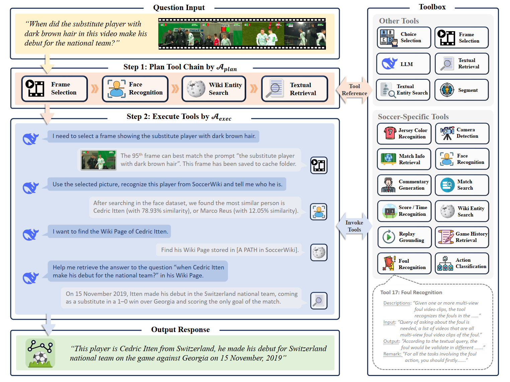
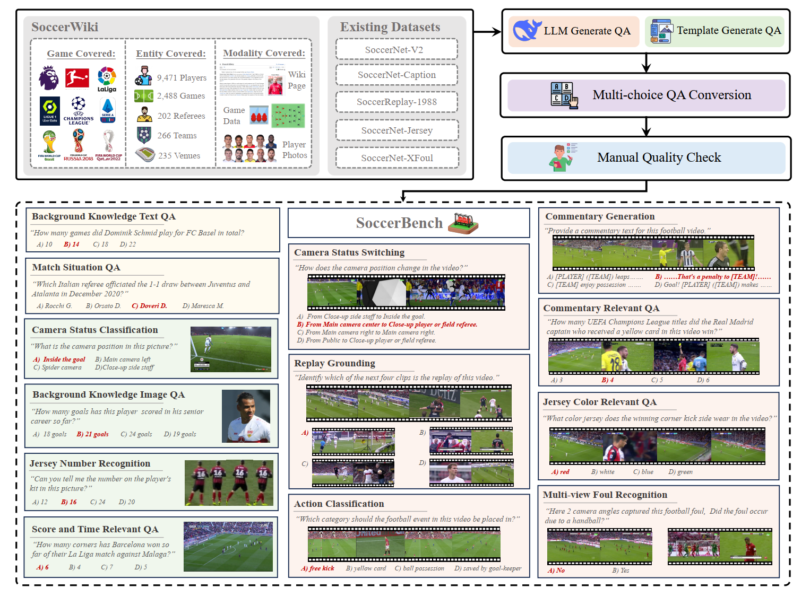

# SoccerAgent: Multi-Agent System for Comprehensive Soccer Understanding (ACM Multimedia 2025)
This repository contains the official introduction and codes implementation for paper **"Multi-Agent System for Comprehensive Soccer Understanding"** in [ACM Multimidia 2025](https://acmmm2025.org/).

[Paper](https://arxiv.org/abs/2505.03735) ⋅ [WebPage](https://jyrao.github.io/SoccerAgent) ⋅ [Benchmark](https://huggingface.co/datasets/Homie0609/SoccerBench) ⋅ [Database](https://huggingface.co/datasets/Homie0609/SoccerWiki)

## News
<!-- [2025.10] SoccerNet Challenge 2026 is about to be launched. -->
[2025.09] The official implementation codes are released.
[2025.09] We released our soccer database **SoccerWiki**.
[2025.07] SoccerAgent is accepted by ACM MM 2025, see you in Dublin.🎉
[2025.06] Our benchmark of comprehensive soccer QA **SoccerBench** is released on Huggingface.
[2025.05] Our pre-preint paper is released on arXiv.

## Requirements
To install the required dependencies for the project, simply run the following command:

```bash
pip install -r requirements.txt
```

## SoccerAgent
The basic structure is shown as following, with more details of implementation as shown here.


In order to successfully run the pipeline, you have to follow these steps and adjust some paths and settings in the codes as here shows:

### Step 1: Distribute Database
We have released our database [SoccerWiki](https://huggingface.co/datasets/Homie0609/SoccerWiki), which would be used in some of tools in our SoccerAgent. As the total database should be in the format as:

``````
└─ SoccerAgent_codebase
    ├─ database
    │     ├─ Game_dataset
    │     │   ├─ england_epl_2014-2015
    │     │   │          ├─2015-02-21 - 18-00 Chelsea 1 - 1 Burnley
    │     │   │         ...
    │     │   ├─ ...
    │     │   ├─ england_epl_2019-2020
    │     │  ...
    │     │
    │     ├─ Game_dataset_csv
    │     │    └─ game_database.csv
    │     └─ SoccerWiki
    │          ├─ data
    │          │   ├─ player
    │          │   ├─ referee
    │          │   ├─ team
    │          │   └─ venue
    │          └─ pic
    │              ├─ player
    │              ├─ referee
    │              ├─ team
    │              └─ venue
    ├─ toolbox
    │    
   ...    
``````
Here, you have to unzip the file `./database/Game_dataset.tar.gz` to proper place. 
SoccerWiki could be found in [🤗SoccerWiki](https://huggingface.co/datasets/SJTU-AI4Sports/SoccerWiki) and you can easily download it directly to the correct location for use in your project.

### Step 2: Distribute Toolbox
In our official codes, there are some tools we need to invoke, if you want to run the same baseline as ours, you have to adjust the codes with the distributions as following. If you want to add some of your own tools, don't forget to add them into `./toolbox/__init__.py` and `./toolbox.csv`. Also, you need to replace all the `YOUR_PROJECT_PATH` and `YOUR_FOLDER_PATH_TO_SOCCERAGENT_CODEBASE` to your exact code base path.

#### 1. Camera Detection
In *./toolbox/camera_detection.py*:
Line 35, 37: replace with your gpt-4o API key and URL.

#### 2. Shot Change
In *./toolbox/shot_change.py*:
Line 53: replace with actual helper files path to save the temporary clips
Using [PySceneDetect](https://www.scenedetect.com/) open-source software.

#### 3. Face Recognition
In *./toolbox/face_rec.py*:
Line 38: replace with actual face library path. 
To build face library, you can use the line 8 `build_face_library` function in it with the base path to the SoccerWiki directory containing players' images.
Using [Face Recognition](https://github.com/ageitgey/face_recognition) open-source tool.

#### 4. Replay Grounding
In *./toolbox/replay_grounding.py*:
Line 76: Replace with your temporary path for compressed video

#### 5. Segment
In *./toolbox/segment.py*:
Line 11, 12: You should install [GroundingDINO](https://github.com/IDEA-Research/GroundingDINO) firstly, and replace with your corresponding config path ([download link](https://github.com/IDEA-Research/GroundingDINO/blob/main/groundingdino/config/GroundingDINO_SwinB_cfg.py)) and model weight path ([download link](https://github.com/IDEA-Research/GroundingDINO/releases/download/v0.1.0-alpha2/groundingdino_swinb_cogcoor.pth)).
Line 15: replace with your helper file path to save the output image

#### 6. Jersey Number Recognition
In *./toolbox/jn_rec.py*:
Line 29: replace with your actual model path, you can download it from [Link](https://drive.usercontent.google.com/download?id=18HAuZbge3z8TSfRiX_FzsnKgiBs-RRNw&authuser=0) in [Repo](https://github.com/mkoshkina/jersey-number-pipeline).

#### 7. Commentary Generation & Action Classification
In *./toolbox/unisoccer/inference/distribution.py*:
Line 99, 106: replace the checkpoint files as annotations in [UniSoccer](https://huggingface.co/Homie0609/UniSoccer).
The code base of the part *./toolbox/unisoccer* is borrowed from [here](https://github.com/jyrao/UniSoccer).

#### 8. Frame Selection
In *./toolbox/frame_selection.py*:
Line 14: replace a cache folder to save the intermediate figures.
Line 49: use the cuda devide as you want.

#### 9. Game Search
In *./toolbox/game_search.py*:
Line 91: fill in the game database csv file (initialized in database/Game_dataset_csv/game_database.csv)

#### 10. Score Time Detection
In *./toolbox/score_time_det.py*:
Line 77, 78: replace with the cache folder as you want.

### Step 3: Run the Baseline

We provide three methods for running the baseline:

#### 1. Single Question with SoccerAgent

After you have set up all the requiremens above, you can directly invoke the function `EXECUTE_TOOL_CHAIN` in `./multiagent_platform.py`, where `query` is a text input and `material` is a list of file paths.

#### 2. Question Series with SoccerAgent
If you are going to run the SoccerAgent with a series of questions, you might need to run the code:
```
python ./platform_full_version.py --input_file PATH_TO_QUESTIONS_JSON --output_file PATH_TO_OUTPUT_JSON
```
where the json files could be found [here](https://huggingface.co/datasets/Homie0609/SoccerBench).

#### 3. Using Other Tools and APIs
We provide baseline implementations for two models: **Qwen2.5VL** and **GPT4o**. You can run QA tests with either of these models by passing the appropriate arguments to the script `./baseline/baseline.py`.

Here is how you can run the script:

```bash
python ./baseline/baseline.py --model <model_type> --input_file <input_json_file> --output_file <output_csv_file> [--api_key <gpt_api_key>] [--model_path <qwen_model_path>]
```
- `--model`: Specify the model to use. Options are `qwen` for Qwen2.5VL and `gpt` for GPT4o.
- `--input_file`: Path to the input JSON file containing a series of questions.
- `--output_file`: Path to the output CSV file where results will be saved.
- `--api_key`: (Required if using GPT4o) Your API key for accessing GPT4o services.
- `--model_path`: (Required if using Qwen2.5VL) Path to the local Qwen2.5VL model.


## Benchmark💺
We proposed a benchmark of comprehensive soccer understanding, which is the largest and most comprehensive soccer-specific benchmark, featuring around 10K standardized multimodal (text, image, video) multi-choice QA pairs across 14 distinct understanding tasks, curated through automated pipelines and manual verification. The benchmark files and more details could be found [here](https://huggingface.co/datasets/Homie0609/SoccerBench).




## Citation
If you use this code and data for your research or project, please cite (to be updated...):

	@article{rao2025socceragent,
            title={Multi-Agent System for Comprehensive Soccer Understanding},
            author={Rao, Jiayuan and Li, Zifeng and Wu, Haoning and Zhang, Ya and Wang, Yanfeng and Xie, Weidi},
            journal={arXiv preprint arXiv:2505.03735},
            year={2025}
      }

## TODO
- [x] Release Paper
- [x] Release Benchmark
- [x] Release Database
- [x] Release Agent Codes

## Contact
If you have any questions, please feel free to contact jy_rao@sjtu.edu.cn or zifengli@sjtu.edu.cn.

## Acknowledgement
This work is based on many previous projects in visual understanding, sports understanding, AI agent and so on. Thanks to [SoccerNet Team](https://www.soccer-net.org/), [Qwen](https://chat.qwen.ai/), [DeepSeek](https://www.deepseek.com/) and so on, which provide a strong basis of our tools, dataset and pipeline. Also, some of our previous works [MatchTime](https://github.com/jyrao/MatchTime), [UniSoccer](https://github.com/jyrao/UniSoccer) help with the implementation.