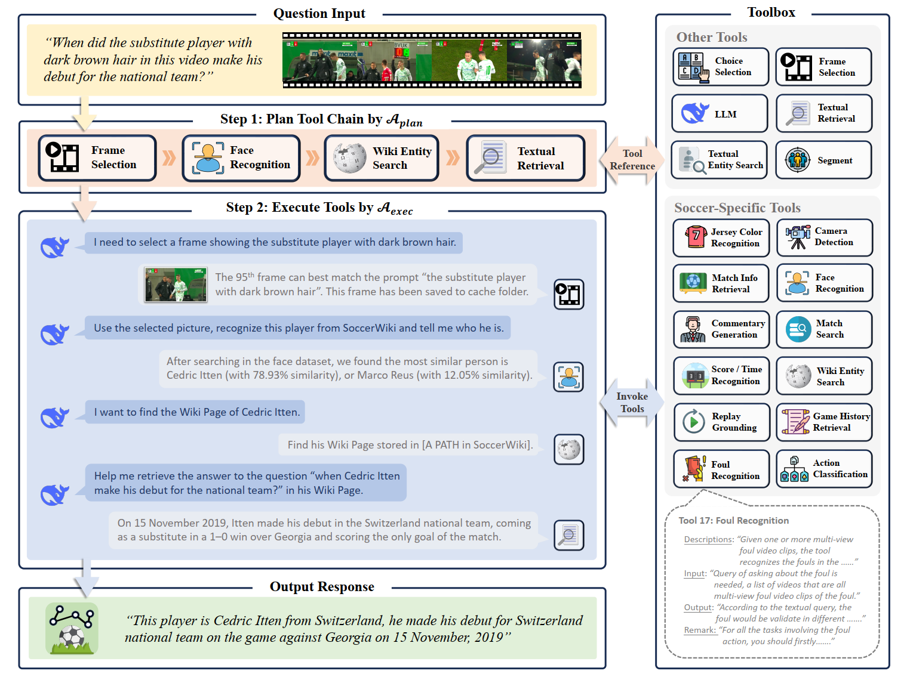
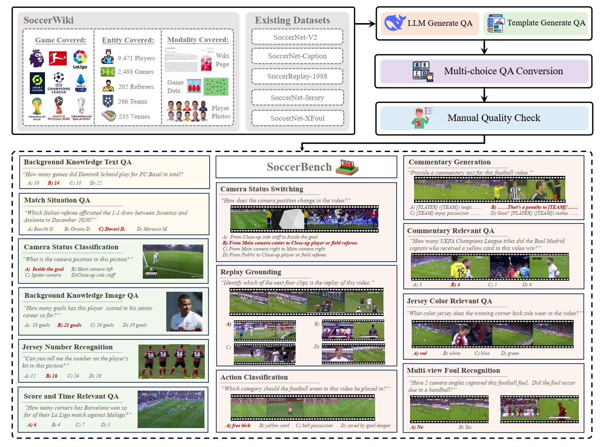

# SoccerAgent
This repository contains the official introduction and codes implementation for paper **"Multi-Agent System for Comprehensive Soccer Understanding"**.

[Paper(Soon)](https://arxiv.org/) ⋅ [WebPage](https://jyrao.github.io/SoccerAgent) ⋅ [Dataset(Soon)](https://huggingface.co/)

## News
[2025.05] Our pre-preint paper is released on arXiv.

## Requirements
To be updated...

## SoccerAgent
The basic structure is shown as following, with more details of implementation to be updated...

## Benchmark💺
To be updated......

## Citation
If you use this code and data for your research or project, please cite (to be updated...):

	@InProceedings{rao2025socceragent,
            title   = {Multi-Agent System for Comprehensive Soccer Understanding},
            author  = {Rao, Jiayuan and Li, Zifeng and Wu, Haoning and Zhang, Ya and Wang, Yanfeng and Xie, Weidi},
            booktitle = {Technical Report},
            year    = {2025},
      }

## TODO
- [ ] Release Paper
- [ ] Release Benchmark
- [ ] Release Agent Codes

## Contact
If you have any questions, please feel free to contact jy_rao@sjtu.edu.cn or zifengli@sjtu.edu.cn.